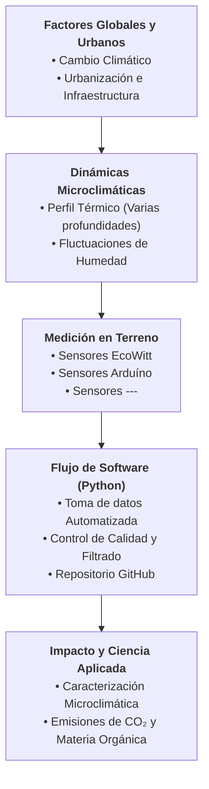

# Análisis de variables micro climáticas en la ciudad

## Conceptual framework
La interacción entre el cambio climático global y el desarrollo urbano genera presiones ambientales localizadas sobre los ecosistemas del suelo. En entornos urbanos, las alteraciones en la cobertura del suelo, la masa térmica de las infraestructuras y la pérdida de vegetación modifican los balances de energía y las dinámicas microclimáticas. Aunque la temperatura del suelo gobierna directamente la descomposición de la materia orgánica y los flujos de dióxido de carbono ($\text{CO}_2$), la medición de microclimas subterráneos con alta resolución espacial y temporal sigue siendo escasa en zonas urbanas.

## Objectives
- General objective: Implementar un sistema de medición de humedad y temperatura con el fin de recopilar datos ambientales en el campus San Joaquín.
- Especific objective 1: Testear sensores de temperaturas en el campus San Joaquín.
- Especific objective 2: Analizar datos y comparar sensores.
