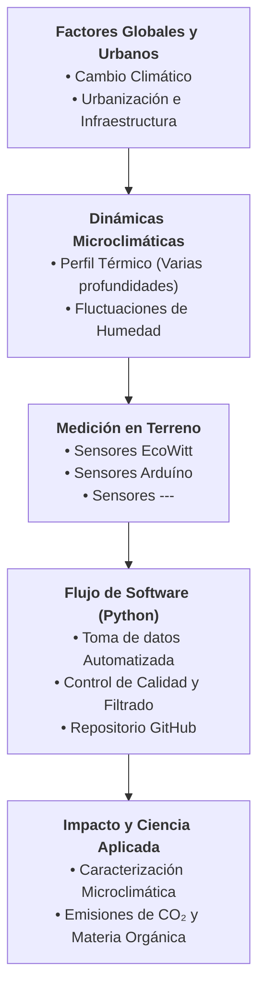

# Análisis de variables micro climáticas en la ciudad


 
> Sistema automatizado de monitoreo microclimático en el campus San Joaquín (UC), orientado a caracterizar la interacción suelo–atmósfera en entornos urbanos mediante sensores EcoWitt.

---

## Conceptual framework
La interacción entre el cambio climático global y el desarrollo urbano genera presiones ambientales localizadas sobre los ecosistemas del suelo. En entornos urbanos, las alteraciones en la cobertura del suelo, la masa térmica de las infraestructuras y la pérdida de vegetación modifican los balances de energía y las dinámicas microclimáticas. Aunque la temperatura del suelo gobierna directamente la descomposición de la materia orgánica y los flujos de dióxido de carbono ($\text{CO}_2$), la medición de microclimas subterráneos con alta resolución espacial y temporal sigue siendo escasa en zonas urbanas.


```mermaid
graph TD
    A["<b>Factores Globales y Urbanos</b><br/>• Cambio Climático<br/>• Urbanización e Infraestructura"] --> B
    B["<b>Dinámicas Microclimáticas</b><br/>• Perfil Térmico (Varias profundidades)<br/>• Fluctuaciones de Humedad"] --> C
    C["<b>Medición en Terreno</b><br/>• Sensores EcoWitt<br/>• Sensores Arduíno<br/>• Sensores ---"] --> D
    D["<b>Flujo de Software (Python)</b><br/>• Toma de datos Automatizada<br/>• Control de Calidad y Filtrado<br/>• Repositorio GitHub"] --> E
    E["<b>Impacto y Ciencia Aplicada</b><br/>• Caracterización Microclimática<br/>• Emisiones de CO₂ y Materia Orgánica"]
```
### How to use ecowitt sensors
1. En primer lugar, se debe conectar el gateway GW1100 a la corriente por medio de un adaptador usb, no de manera directa a la fuente de poder.
2. Descargar en Play Store / App Store la aplicación de ecowitt y registrarse / iniciar sesión.
3. Dirigirse a la sección de dispositivos y seleccionar "Agregar nuevos dispositivos".
4. Seleccionar el tipo de estación meteorológica correspondiente.
    
6. Mantener pulsado el botón central del gateway hasta que la luz parpadee rápidamente.
7. Conectarse a la red wifi "GW1XXXX-XXX" y regresar a la aplicación.
8. Ingresar la señal wifi a la que quiera que se conecte el gateway y la contraseña correspondiente.
    
9. Si el gateway no detecta automáticamente cada sensor dirigirse a: "Configuración del dispositivo" ---> "ID del sensor". Deberá buscar el tipo de sensor correspondiente y registrar el ID manualmente, este se encontrará en una etiqueta en algún lugar del mismo sensor.
    
10. Una vez conectados, los datos obtenidos se mostrarán en la aplicación.

---

## Objectives
 
**Objetivo general**
Implementar un sistema de medición de humedad y temperatura con el fin de recopilar datos ambientales en el campus San Joaquín.
 
**Objetivos específicos**
1. Testear sensores de temperatura en el campus San Joaquín.
2. Analizar datos y comparar sensores.

---

## Repository Structure
 
```
ecowitt-instructions/
├── .github/
│   └── workflows/
│       └── ecowitt_fetch.yml     # Automatización (GitHub Actions, cron cada 2h)
├── data/
│   └── ecowitt-sj/
│       ├── ecowitt_data.csv          # Datos crudos en formato largo (long)
│       ├── ecowitt_data_wide.csv     # Datos pivotados en formato ancho (wide), hora local Chile
│       └── temperatura_humedad.png   # Gráfico actualizado automáticamente
├── scripts/
│   └── fetch_ecowitt.py          # Script principal: descarga, procesa y grafica
├── requirements.txt               # Dependencias de Python
└── README.md
```

---

## How the Pipeline Works
 
El repositorio corre de forma **100% automatizada** gracias a GitHub Actions:
 
1. **Disparo (`trigger`)**: el workflow [`ecowitt_fetch.yml`](.github/workflows/ecowitt_fetch.yml) se ejecuta cada 2 horas (`cron: "0 0 */2 * *"`) o manualmente vía `workflow_dispatch`.
2. **Descarga**: [`fetch_ecowitt.py`](scripts/fetch_ecowitt.py) consulta la API de Ecowitt (`/device/real_time` y `/device/history`), detecta dinámicamente qué grupos de sensores reporta la estación (excluyendo batería) y descarga el historial faltante.
3. **Backfill inteligente**: cada corrida revisa además las últimas horas (`ECOWITT_BACKFILL_HOURS`, por defecto 24h) para rellenar posibles vacíos si el cron falló o la estación estuvo offline.
4. **Procesamiento**: los datos se combinan con el CSV existente, se eliminan duplicados (`timestamp` + `variable`) y se guardan en dos formatos:
   - **Largo** (`ecowitt_data.csv`): una fila por lectura, ideal para análisis y control de calidad.
   - **Ancho** (`ecowitt_data_wide.csv`): pivotado por variable y convertido a hora local (`America/Santiago`), ideal para graficar o abrir en Excel.
5. **Visualización**: se regenera automáticamente [`temperatura_humedad.png`](data/ecowitt-sj/temperatura_humedad.png) con dos paneles (temperatura y humedad).
6. **Commit automático**: si hubo cambios, el bot de GitHub Actions hace commit y push directo a `main`.

---

## Data
 
| Archivo | Formato | Descripción |
|---|---|---|
| `ecowitt_data.csv` | Long | Columnas: `timestamp` (UTC), `variable`, `unit`, `value` |
| `ecowitt_data_wide.csv` | Wide | Índice: `timestamp_local (America/Santiago)`; una columna por variable |
| `temperatura_humedad.png` | Imagen | Serie de tiempo de temperatura y humedad, actualizada cada corrida |
 
**Variables monitoreadas actualmente:**
 
| Grupo | Variables |
|---|---|
| Temperatura | `indoor.temperature`, `temp_ch1.temperature`, `temp_ch2.temperature` |
| Humedad / Suelo | `indoor.humidity`, `soil_ch1.soilmoisture`, `soil_ch2.soilmoisture` |
 
> ⚠️ Nota: la lista de variables graficadas está fija en el script (`VARIABLES_TEMPERATURA`, `VARIABLES_HUMEDAD`). Si se agregan nuevos sensores (ej. más canales de suelo o temperatura), estas listas deben actualizarse manualmente.
 
### Chart Preview
 
<!-- Se recomienda usar la URL "raw" de GitHub para que la imagen se actualice sola en cada commit -->

