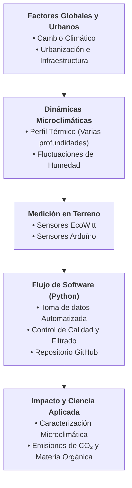

# Analysis of Urban Microclimatic Variables


 
> Sistema automatizado de monitoreo microclimático en el campus San Joaquín (UC), orientado a caracterizar la interacción suelo–atmósfera en entornos urbanos mediante sensores EcoWitt.

---

## Conceptual framework
La interacción entre el cambio climático global y el desarrollo urbano genera presiones ambientales localizadas sobre los ecosistemas del suelo. En entornos urbanos, las alteraciones en la cobertura del suelo, la masa térmica de las infraestructuras y la pérdida de vegetación modifican los balances de energía y las dinámicas microclimáticas. Aunque la temperatura del suelo gobierna directamente la descomposición de la materia orgánica y los flujos de dióxido de carbono ($\text{CO}_2$), la medición de microclimas subterráneos con alta resolución espacial y temporal sigue siendo escasa en zonas urbanas.


```mermaid
graph TD
    A["<b>Factores Globales y Urbanos</b><br/>• Cambio Climático<br/>• Urbanización e Infraestructura"] --> B
    B["<b>Dinámicas Microclimáticas</b><br/>• Perfil Térmico (Varias profundidades)<br/>• Fluctuaciones de Humedad"] --> C
    C["<b>Medición en Terreno</b><br/>• Sensores EcoWitt<br/>• Sensores Arduíno"] --> D
    D["<b>Flujo de Software (Python)</b><br/>• Toma de datos Automatizada<br/>• Control de Calidad y Filtrado<br/>• Repositorio GitHub"] --> E
    E["<b>Impacto y Ciencia Aplicada</b><br/>• Caracterización Microclimática<br/>• Emisiones de CO₂ y Materia Orgánica"]
```
### How to use ecowitt sensors
1. En primer lugar, se debe conectar el gateway GW1100 a la corriente por medio de un adaptador usb, no de manera directa a la fuente de poder.
2. Descargar en Play Store / App Store la aplicación de ecowitt y registrarse / iniciar sesión.
3. Dirigirse a la sección de dispositivos y seleccionar "Agregar nuevos dispositivos".
4. Seleccionar el tipo de estación meteorológica correspondiente.

    
6. Mantener pulsado el botón central del gateway hasta que la luz parpadee rápidamente.
7. Conectarse a la red wifi "GW1XXXX-XXX" y regresar a la aplicación.
8. Ingresar la señal wifi a la que quiera que se conecte el gateway y la contraseña correspondiente.

    
10. Si el gateway no detecta automáticamente cada sensor dirigirse a: "Configuración del dispositivo" ---> "ID del sensor". Deberá buscar el tipo de sensor correspondiente y registrar el ID manualmente, este se encontrará en una etiqueta en algún lugar del mismo sensor.

    
12. Una vez conectados, los datos obtenidos se mostrarán en la aplicación.

---

## Objectives
 
#### Objetivo general
Implementar un sistema de medición de humedad y temperatura con el fin de recopilar datos ambientales en el campus San Joaquín.
 
#### Objetivos específicos
1. Testear sensores de temperatura en el campus San Joaquín.
2. Analizar datos y comparar sensores.

---

## Repository Structure
 
```
ecowitt-instructions/
├── .github/
│   └── workflows/
│       └── ecowitt_fetch.yml     # Automatización (GitHub Actions, cron cada 48h)
├── data/
│   ├── ecowitt-sj/
│   │   ├── ecowitt_data.csv          # Datos en formato largo (long), promedio por hora
│   │   ├── ecowitt_data_wide.csv     # Datos pivotados en formato ancho (wide), hora local Chile
│   │   └── temperatura_humedad.png   # Gráfico actualizado automáticamente
│   ├── Datos_INIA/
│   │   ├── datos_2026_INIA-4_TS10_MAX.csv   # Temp. suelo 10cm, máximo diario (INIA La Platina)
│   │   └── datos_2026_INIA-4_TS10_MIN.csv   # Temp. suelo 10cm, mínimo diario (INIA La Platina)
│   └── analisis_inia/
│       ├── comparacion_temp_suelo.csv       # Salida del script de comparación
│       └── comparacion_temp_suelo.png
├── scripts/
│   ├── fetch_ecowitt.py               # Script principal: descarga, procesa y grafica
│   └── comparar_temp_suelo_inia.py    # Compara temp. de suelo propia vs. INIA
├── requirements.txt               # Dependencias de Python
├── .gitignore
└── README.md
```

---

## How the Pipeline Works
 
El repositorio corre de forma 100% automatizada gracias a GitHub Actions:
 
1. **Disparo (`trigger`)**: el workflow [`ecowitt_fetch.yml`](.github/workflows/ecowitt_fetch.yml) se ejecuta cada 48h (`cron: "0 0 */2 * *"` → días impares del mes a las 00:00 UTC, es decir cada 2 *días*, no cada 2 horas) o manualmente vía `workflow_dispatch`.
2. **Descarga**: [`fetch_ecowitt.py`](scripts/fetch_ecowitt.py) consulta la API de Ecowitt (`/device/real_time` y `/device/history`), detecta dinámicamente qué grupos de sensores reporta la estación (excluyendo batería) y descarga el historial faltante desde el último timestamp guardado.
3. **Backfill inteligente**: además de continuar desde el último dato guardado, cada corrida vuelve a revisar una ventana de horas recientes (`ECOWITT_BACKFILL_HOURS`, por defecto 60h) y sobrescribe esas horas si la API entrega valores corregidos o completados retroactivamente (por ejemplo, si la estación estuvo offline y el dato llegó tarde al servidor de Ecowitt).
4. **Procesamiento**: las lecturas nuevas (que llegan cada ~5 min) se agrupan en un promedio por hora, por variable, antes de guardarse. Luego se combinan con el CSV existente, se eliminan duplicados (`timestamp` + `variable`, quedándose con el promedio más reciente si una hora se recalcula) y se guardan en dos formatos:
   - **Largo** (`ecowitt_data.csv`): una fila por hora y variable, sin filtrar ninguna — incluye todo lo que entrega la API, tal cual.
   - **Ancho** (`ecowitt_data_wide.csv`): pivotado por variable y convertido a hora local (`America/Santiago`), ideal para graficar o abrir en Excel. Excluye las variables `_high`/`_low` (ver nota en [Data](#data)).
5. **Visualización**: se regenera automáticamente [`temperatura_humedad.png`](data/ecowitt-sj/temperatura_humedad.png) con dos paneles (temperatura y humedad).
6. **Commit automático**: si hubo cambios, el bot de GitHub Actions hace commit y push directo a `main`.

### Configuración (variables de entorno)

**Secrets requeridos** (GitHub → Settings → Secrets and variables → Actions):

| Variable | Descripción |
|---|---|
| `ECOWITT_APPLICATION_KEY` | Application Key de la cuenta Ecowitt |
| `ECOWITT_API_KEY` | API Key de la cuenta Ecowitt |
| `ECOWITT_MAC` | MAC address de la estación (`AA:BB:CC:DD:EE:FF`) |

**Variables opcionales** (ajustables como *Repository variables*, o al correr el script a mano):

| Variable | Default | Descripción |
|---|---|---|
| `ECOWITT_LOOKBACK_HOURS` | `2` | Cuántas horas hacia atrás mirar en la primera corrida (cuando todavía no existe `ecowitt_data.csv`) |
| `ECOWITT_BACKFILL_HOURS` | `60` | Ventana que se vuelve a revisar en cada corrida para capturar correcciones tardías de la API |
| `ECOWITT_CALLBACK` | *(auto)* | Lista de grupos de sensores separados por coma, para forzarla manualmente en vez de auto-detectarla |

---

## Data
 
| Archivo | Formato | Resolución | Descripción |
|---|---|---|---|
| `ecowitt_data.csv` | Long | 1 hora (promedio) | Columnas: `timestamp` (UTC), `variable`, `unit`, `value`. Incluye todas las variables que entrega la API, sin filtrar. |
| `ecowitt_data_wide.csv` | Wide | 1 hora (promedio) | Índice: `timestamp_local (America/Santiago)`; una columna por variable. No incluye las variables `_high`/`_low` (ver nota abajo). |
| `temperatura_humedad.png` | Imagen | — | Serie de tiempo de temperatura y humedad, actualizada cada corrida |
 
### Variables monitoreadas actualmente:
 
| Grupo | Variables | Unidad |
|---|---|---|
| Temperatura | `indoor.temperature`, `temp_ch1.temperature`, `temp_ch2.temperature` | °C |
| Humedad / Suelo | `indoor.humidity`, `soil_ch1.soilmoisture`, `soil_ch2.soilmoisture` | % |
 
> Nota: la lista de variables graficadas está fija en el script (`VARIABLES_TEMPERATURA`, `VARIABLES_HUMEDAD`). Si se agregan nuevos sensores (ej. más canales de suelo o temperatura), estas listas deberán actualizarse manualmente.
 
> Nota sobre `_high`/`_low`: la API a veces entrega variables como `indoor.temperature_high`/`_low` (máximos/mínimos), pero de forma muy esporádica en la práctica, dejando ventanas sin datos. Por eso se excluyen del _CSV wide_ , aunque siguen disponibles en `ecowitt_data.csv` por si se necesitan.
 
> Nota histórica: hasta septiembre 1 de 2026 los datos se guardaban con una lectura cada 5 minutos, lo que hacía crecer `ecowitt_data.csv` muy rápido (varios MB por semana) y con eso también el historial de git, ya que cada corrida "commiteaba" el archivo completo. Se migró a promedios por hora (reduciendo el volumen 12 veces) y todo el histórico existente se convirtió retroactivamente al mismo formato, así que el archivo es uniforme en resolución horaria desde el primer dato disponible.
 
### Chart Preview
 
<!-- Se recomienda usar la URL "raw" de GitHub para que la imagen se actualice sola en cada commit -->


---

## Comparation with INA

`data/Datos_INIA/` contiene datos externos de la Red Agrometeorológica de INIA estación La Platina (La Pintana): temperatura de suelo a 10cm, máximo y mínimo diario.

[`scripts/comparar_temp_suelo_inia.py`](scripts/comparar_temp_suelo_inia.py) cruza esos datos contra los sensores propios de temperatura de suelo:

| Sensor propio | Profundidad | Comparable con INIA |
|---|---|---|
| `temp_ch1.temperature` | 10-15cm | Directo (INIA mide a 10cm) |
| `temp_ch2.temperature` | 20-25cm | Secundario (más profundo, referencia) |

Para cada día en común, calcula el máximo/mínimo propio (agregando los promedios horarios ya guardados) y lo compara contra el de INIA. Genera `data/analisis_inia/comparacion_temp_suelo.csv` (detalle día a día) y `comparacion_temp_suelo.png` (gráfico). Para actualizar la comparación con datos más recientes, basta con volver a correr el script.

### Limitations
- El máximo/mínimo propio se calcula desde promedios horarios, mientras que INIA muestrea de forma continua. Esto genera un sesgo  esperable (los máximos propios salen más bajos, los mínimos más altos que los de INIA) que no es necesariamente un problema de calibración del sensor.
- El traslape de fechas está limitado por cuándo empiezan los datos propios (agosto 2026 en adelante), el archivo de INIA parte antes.
- La columna `% de datos` de INIA indica el porcentaje de datos diarios, el script no descarta días incompletos por defecto.

---

## Licence
This project is licensed under the MIT License — see the LICENSE file for details.
