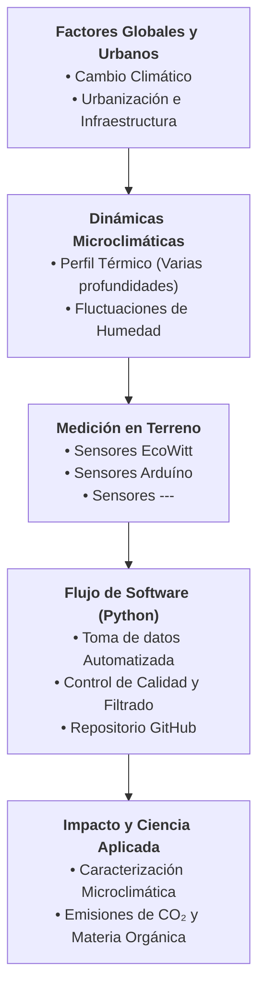

# Análisis de variables micro climáticas en la ciudad

## Conceptual framework
La interacción entre el cambio climático global y el desarrollo urbano genera presiones ambientales localizadas sobre los ecosistemas del suelo. En entornos urbanos, las alteraciones en la cobertura del suelo, la masa térmica de las infraestructuras y la pérdida de vegetación modifican los balances de energía y las dinámicas microclimáticas. Aunque la temperatura del suelo gobierna directamente la descomposición de la materia orgánica y los flujos de dióxido de carbono ($\text{CO}_2$), la medición de microclimas subterráneos con alta resolución espacial y temporal sigue siendo escasa en zonas urbanas.

```mermaid
graph TD
    A["<b>Factores Globales y Urbanos</b><br/>• Cambio Climático<br/>• Urbanización e Infraestructura"] --> B
    B["<b>Dinámicas Microclimáticas</b><br/>• Perfil Térmico (Varias profundidades)<br/>• Fluctuaciones de Humedad"] --> C
    C["<b>Medición en Terreno</b><br/>• Sensores EcoWitt<br/>• Sensores Arduíno<br/>• Sensores ---"] --> D
    D["<b>Flujo de Software (Python)</b><br/>• Toma de datos Automatizada<br/>• Control de Calidad y Filtrado<br/>• Repositorio GitHub"] --> E
    E["<b>Impacto y Ciencia Aplicada</b><br/>• Caracterización Microclimática<br/>• Emisiones de CO₂ y Materia Orgánica"]
```
### How to use ecowitt sensors
1. En primer lugar, se debe conectar el gateway GW1100 a la corriente por medio de un adaptador usb, no de manera directa a la fuente de poder.
2. Descargar en Play Store / App Store la aplicación de ecowitt y registrarse / iniciar sesión.
3. Dirigirse a la sección de dispositivos y seleccionar "Agregar nuevos dispositivos".
4. Seleccionar el tipo de estación meteorológica correspondiente.
    
6. Mantener pulsado el botón central del gateway hasta que la luz parpadee rápidamente.
7. Conectarse a la red wifi "GW1XXXX-XXX" y regresar a la aplicación.
8. Ingresar la señal wifi a la que quiera que se conecte el gateway y la contraseña correspondiente.
    
9. Si el gateway no detecta automáticamente cada sensor dirigirse a: "Configuración del dispositivo" ---> "ID del sensor". Deberá buscar el tipo de sensor correspondiente y registrar el ID manualmente, este se encontrará en una etiqueta en algún lugar del mismo sensor.
    
10. Una vez conectados, los datos obtenidos se mostrarán en la aplicación.

## Objectives
- General objective: Implementar un sistema de medición de humedad y temperatura con el fin de recopilar datos ambientales en el campus San Joaquín.
- Especific objective 1: Testear sensores de temperaturas en el campus San Joaquín.
- Especific objective 2: Analizar datos y comparar sensores.

